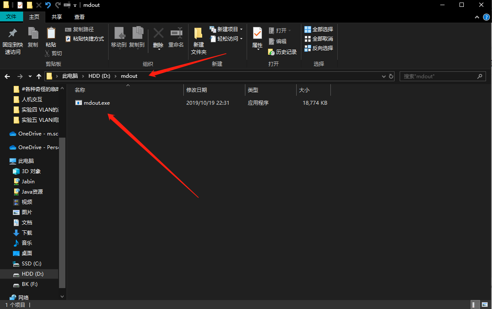
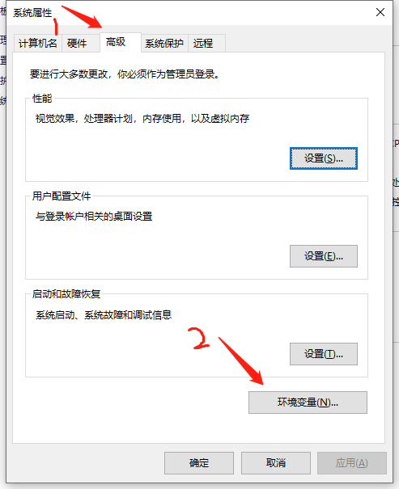

# mdout

一个Go语言实现的Markdown转PDF命令行工具，基于headless chrome，简单、可靠、易安装、可定制化、易拓展

## mdout有何特点

### 简单

mdout会根据后缀，自动识别输入类型

```cmd
mdout markdown.md
mdout local_html.html
mdout http://www.baidu.com
```

### 可靠

mdout可以完整保留你md文件里的代码格式，图片，甚至是jax数学公式，mermaid流程图。

电脑不会如人一般等待页面加载完全再选择打印，电脑自动执行打印时页面尚未渲染完全是件非常头疼的事情，对此，mdout没有简单地使用sleep休眠机制去碰运气，而是实现了一套非常简单的同步渲染机制，即便是你有1万行的mathjax数学公式、1万行的代码语法高亮要渲染，mdout都能完美的保证你的pdf上不会有任何一个未渲染完成的元素

### 易安装

除了chrome，mdout不依赖于其他任何环境，你只需要选择对于系统的安装包，下载并解压即可使用，更为macOS和linux提供了一键安装脚本，为windows提供了丰富的图文教程

### 可定制化

mdout将每个模板独立为主题，并且支持指定输出html文件，可以很方便地自定义页面配色，自定义语法高亮配色

### 易拓展

mdout基于headless chrome，这使得mdout几乎兼容市面上所有能用于的前端组件，并且mdout将组件归类为主题的一部分，你同样可以输出html来调试自己的自定义拓展插件

## 获取和安装

mdout同时支持windows，linux，macOS，但目前只支持64位的系统  

|系统|下载连接|
|-|-|
|linux|[mdout.linux.x86-64.tar.gz](https://github.com/JabinGP/mdout/releases/download/v0.6/mdout.linux.x86-64.tar.gz)|
|macOS|[mdout.macOS.x86-64.tar.gz](https://github.com/JabinGP/mdout/releases/download/v0.6/mdout.macOS.x86-64.tar.gz)|
|windows|[mdout_windows_x86-64.tar.gz](https://github.com/JabinGP/mdout/releases/download/v0.6/mdout_windows_x86-64.tar.gz)|

由于大陆访问github速度非常慢，这里提供一个加速的下载链接，但无法该链接可用性做出保证，如果出现无法下载的情况请提issues：

|系统|加速下载连接|
|-|-|
|linux|[mdout.linux.x86-64.tar.gz](https://ghproxy.cfjabin.workers.dev/https://github.com/JabinGP/mdout/releases/download/v0.6/mdout.linux.x86-64.tar.gz)|
|macOS|[mdout.macOS.x86-64.tar.gz](https://ghproxy.cfjabin.workers.dev/https://github.com/JabinGP/mdout/releases/download/v0.6/mdout.macOS.x86-64.tar.gz)|
|windows|[mdout_windows_x86-64.tar.gz](https://ghproxy.cfjabin.workers.dev/https://github.com/JabinGP/mdout/releases/download/v0.6/mdout_windows_x86-64.tar.gz)|

mdout已经为各平台打包了可执行文件，因此无论何种方式安装，无非就是下载可执行文件压缩包后解压缩，解压完就可以在mdout所在文件夹使用mdout了

但是为了命令行使用方便，我更推荐将mdout配置到系统的环境变量中，这样随时随地随心所欲mdout

### 适用于老鸟的安装方式

> 稍微懂点命令行的使用以下命令即可轻松安装，注意{$DownloadLink}替换成上文对应版本的连接

- linux

    ```cmd
    wget {$DownloadLink}
    tar -xvzf mdout.linux.x86-64.tar.gz
    sudo mv mdout /usr/local/bin
    ```

- macOS

    ```cmd
    wget {$DownloadLink}
    tar -xvzf mdout.macOS.x86-64.tar.gz
    mv mdout /usr/local/bin
    ```

### 脚本安装

> 由于版本更新，脚本不由我维护，暂不可用，请手动安装。
> 非常感谢Fisher的脚本支持! [自己日用的脚本](https://github.com/FisherWY/Shell)

linux && macOS推荐使用脚本安装

- curl方式

    ```shell
    bash -c "$(curl -fsSL https://raw.githubusercontent.com/FisherWY/Shell/master/mdout/install_mdout.sh)"
    ```

- wget方式

    ```shell
    bash -c "$(wget https://raw.githubusercontent.com/FisherWY/Shell/master/mdout/install_mdout.sh -O -)"
    ```

### 手动安装

点击前文给出的各版本链接，下载成功后解压缩，你会得到一个mdout可执行文件

#### windows

1. 下载文件

    下载上文链接中windows版的文件，下载后使用zip工具解压缩，解压后会得到一个`mdout.exe`可执行文件

2. 放置软件

    将`mdout.exe`可执行文件放置平时放软件的地方，比如`D:\mdout`这个文件夹里面，此时你的`mdout.exe`的全路径应该是`D:\mdout\mdout.exe`

3. 设置环境变量

    如果不设置环境变量也可以使用，但是缺点是你需要使用cmd，powershell或者gitbash手动进入`D:\mdout`才能使用`mdout`命令

    确定路径
      

    设置环境变量，右键我的电脑 -> 选择属性 -> 左边的高级系统设置
      

    选择高级 -> 点击环境变量
      

    找到下半部分的系统变量，双击`Path`行
      

    在弹出来的窗口选择新建
      

    填入`D:\mdout`，然后一定要连续点完三个确定
      

4. 检验

    打开cmd，或者powershell，或者你有gitbash都ok（推荐使用命令行的windows用户都装一个gitbash），输入`mdout`，看到如下输出就是成功了

    

#### linux

1. 下载

    点击下载上文链接中linux版本，下载完成后解压tar.gz包，解压后会得到一个`mdout`可执行文件

2. 将软件放入可执行文件库

    打开终端，定位到刚刚下载的文件所在路径

    ```cmd
    cd 你的文件所在文件夹
    ```

    然后将可执行文件直接移动到/usr/local/bin，linux环境下需要sudo权限

    ```cmd
    sudo mv ./mdout /usr/local/bin
    ```

    输入密码就可以了

3. 检验是否成功

    输入`mdout --version`，看到版本号输出就是成功了

#### macOS

1. 下载

    下载上文中macOS版本链接，下载后使用工具解压tar.gz包，解压后会得到一个mdout可执行文件

2. 将软件移动到可执行文件库

    打开终端，定位到刚刚下载的文件所在路径

    ```cmd
    cd 你的mdout可执行文件所在文件夹
    ```

    然后将可执行文件直接移动到/usr/local/bin

    ```cmd
    mv ./mdout /usr/local/bin
    ```

3. 检验是否成功移动

    输入`mdout --version`，看到版本号输出就是成功了

## 使用说明

### 使用前提

mdout依赖于chrome浏览器，如果你的电脑已经安装了新版的chrome浏览器，无需更多配置，可以直接运行mdout，如果是旧版的chrome浏览器，建议进行升级后使用，如果还未安装chrome浏览器，请安装后再使用mdout

### 进行系统初始化

> 如果你不是使用脚本安装的，或者脚本安装不完全成功的，需要手动执行初始化，如果脚本安装成功，则跳过这一步

初始化分为两部分：

1. 下载配置文件（如果一直用程序预设参数可以不下载）
2. 下载主题包（至少需要一个主题包mdout才可以工作）

#### 初始化配置文件

执行如下命令即可

```cmd
mdout install config
```

通常来说，程序预设了一个github的配置文件地址，但可能由于网络问题，或者该地址的配置文件版本不对而需要自定义一个配置文件连接，可以通过 `-u` 参数指定一个配置文件链接下载。

```cmd
mdout install config -u {$ConfigLink}
```

|版本|配置文件链接|
|-|-|
|v0.6|[github链接](https://raw.githubusercontent.com/JabinGP/mdout/v0.6/asserts/config/conf.toml)，[大陆加速链接](https://ghproxy.cfjabin.workers.dev/https://raw.githubusercontent.com/JabinGP/mdout/v0.6/asserts/config/conf.toml)|

#### 初始化主题包

下载主题包需要指定两个参数：

1. 第一个参数为 `-u` 接上主题包下载链接
2. 第二个参数 `-n` 指定该主题包下载后命名为什么，推荐名为 `mdout` ，因为不修改配置文件的情况下，mdout默认会使用名为 `gihub` 的主题包。

```cmd
mdout install theme -u {$ThemeDownloadLink} -n {${ThemeName}}
```

|主题|仓库地址|主题包下载链接|
|-|-|-|
|仿github主题v0.6-0.1|[JabinGP/mdout-theme-github](https://github.com/JabinGP/mdout-theme-github)|[github链接](https://github.com/JabinGP/mdout-theme-github/releases/download/v0.6-0.1/mdout-theme-github-v0.6-0.1.zip)，[大陆加速链接](https://ghproxy.cfjabin.workers.dev/https://github.com/JabinGP/mdout-theme-github/releases/download/v0.6-0.1/mdout-theme-github-v0.6-0.1.zip)|

如果你有 `git` 命令则更加简单，直接把 [JabinGP/mdout-theme-github](https://github.com/JabinGP/mdout-theme-github) 或者任何你喜欢的主题克隆到主题文件夹中即可。

进入配置文件夹中的theme目录执行（各平台的配置文件路径见下文）命令，将 [JabinGP/mdout-theme-github](https://github.com/JabinGP/mdout-theme-github) 克隆进 `gihub` 文件夹：

```cmd
git clone https://github.com/JabinGP/mdout-theme-github github
```

如果遇到大陆访问 github 受阻问题，可以尝试使用这个 [大陆加速链接](https://ghproxy.cfjabin.workers.dev/https://github.com/JabinGP/mdout-theme-github)

```cmd
git clone https://ghproxy.cfjabin.workers.dev/https://github.com/JabinGP/mdout-theme-github github
```

### 最简单的示例

```cmd
mdout 文件路径
```

#### 文件路径可以是相对路径

- 文件在当前目录

    ```cmd
    mdout yourfile.md
    ```

- 或文件在上级目录

    ```cmd
    mdout ../yourfile.md
    ```

- 文件路径也可以是绝对路径

    ```cmd
    mdout /tmp/markdown/yourfile.md
    ```

### 帮助文档

每个命令行程序都有帮助文档，mdout也不例外

```cmd
mdout -h
mdout --help
```

### 输入文件类型

mdout支持许多输入类型，其中最普遍的就是markdown，但同样也支持html输入，url输入，但是注意，如果输入是url，不要忘记带上`http://`

- markdown  

    ```cmd
    mdout yourfile.md
    ```

- html  

    ```cmd
    mdout yourfile.html
    ```

- url

    ```cmd
    mdout http://www.baidu.com
    ```

### 输出文件类型

对于markdown输入，mdout支持输出中间过程的结果。但对于html输入或者url输入，它们的唯一输出结果就是pdf文件了

- markdown输出pdf（输出pdf为默认选项)

    ```cmd
    mdout youtfile.md -t pdf  
    mdout yourfile.md
    ```

- markdown输出解析后html标签（这个选项可以得到markdown解析器的解析结果）

    ```cmd
    mdout youtfile.md -t tag
    ```

- markdown输出经过处理后的完整html文件（常常用来调试主题）

    ```cmd
    mdout youtfile.md -t html
    ```

### 输出路径

mdout支持指定输出路径，输出文件名

你可以使用`-o`来指定输出路径，`-o`选项同样做了防呆设计，你可以指定路径但不带文件名，mdout会自动识别你输入文件的文件名和你指定的输出类型为你设置名称，但你同样可以指定路径+文件名

- 指定输出到上级文件夹，自动命名

    ```cmd
    mdout yourfile.md -o ../
    ```

- 指定输出到`/tmp/markdown`文件夹，自动命名

    ```cmd
    mdout yourfile.md -o /tmp/markdown
    ```

- 指定输出到当前文件夹下的`badoutput.name`

    ```cmd
    mdout yourfile.md -o badoutput.name
    ```

    千万不要这么干，尽管程序不会阻止你设置你的文件名，但是使用规范的后缀是个好习惯。

- 指定输出到当前文件夹下的`goodname.pdf`

    ```cmd
    mdout yourfile.md -o goodname.pdf
    ```

### 指定主题

> 主题系统只对markdown输入有效

mdout有着方便易用的主题系统，你可以很自由地自定义主题，mdout预设了一套[github风格的主题](https://github.com/JabinGP/mdout-theme-github)，你应该已经在前文安装过了。

该主题支持代码语法高亮、MathJax数学公式、mermaid流程图。

`mathjax`可以渲染类似这样的公式

```markdown
$$\Gamma(z) = \int_0^\infty t^{z-1}e^{-t}dt\,.$$
```

`mermaid`流程图使用方式

```markdown
    ```mermaid
    graph TD;
        A-->B;
        A-->C;
        B-->D;
        C-->D;
    ```
```

#### 你可以使用`-e`选项来指定主题

- 指定为github主题

    ```cmd
    mdout yourfile.md -e github
    ```

- 指定为其他自定义主题

    ```cmd
    mdout yourfile.md -e {$ThemeName}
    ```

> 指定主题后上面提到的输出选项依旧可用，可以配合`-t html`选项输出中间的html文件，这样可以调试主题效果，详细的说明将在自定义章节中提到

至于自定义主题的教程，将在后面提到

### 打印页面设置

> 此项仅在输出pdf时有效

#### 打印页面大小设置

mdout预设了8种页面大小，如果有更多需求，可以在issues提出

- A1 - A5
- Legal
- Letter
- Tabloid

A4为默认输出页面大小，你可以使用`-f`来指定输出页面的大小。同时做了防呆设计，如果你一不小心打成了大写、小写，甚至你手抽打成了大小写混合，都是可以正常识别的。可惜，防呆不防傻，你把字母都打错了就不能怪我了

- 指定输出pdf页面格式为A4（闲着没事干敲着玩）

    ```cmd
    mdout yourfile.md -f a4
    ```

- 指定输出pdf页面格式为Tabloid

    ```cmd
    mdout yourfile.md -f tabloid
    ```

#### 打印页面方向设置

mdout只支持两种方向

- 纵向：`portrait`
- 横向：`landscape`

默认打印页面方向为纵向，你可以使用`-r`指令来指定页面方向格式

- 指定输出pdf页面格式为横向

    ```cmd
    mdout yourfile.md -r landscape
    ```

#### 打印页面边距设置

mdout支持你自定义页面边距，以英寸为单位，默认为0.4英寸

- 0.4英寸 ≈ 10cm

你可以使用`-m`指令来指定页面边距大小

- 指定打印边距为0.2英寸

    ```cmd
    mdout yourfile.md -m0.2
    ```

- 去除页面边距

    ```cmd
    mdout yourfile.md -m0
    ```

### 修改配置文件

在配置文件安装目录下面

- macOS : /Users/你的用户名/mdout  
- linux: /home/你的用户名/mdout
- windows: /c/users/你的用户名/mdout

有一个`conf.coml`文件，如果没有则说明没有进行上文的初始化下载，该配置文件除了像上文那样指定链接下载，也可以手动创建。

```json
[Parmas]
# 指定使用的主题名称
ThemeName = "github"

# 打印页面选项
PageFormat = "a4"
# 省略，详见 asserts/config/conf.toml
```

### 方便地修改配置文件

mdout 内置了一个 `config` 命令便于快速调用编辑器修改配置文件，该命令默认调用 `code` 命令呼出 vscode 打开配置文件，你可以在配置文件中修改自己需要的命令。详见 asserts/config/conf.toml。

配置编辑器示例：

```toml
[Runtime]
# 使用 windows自带记事本 示例
EditorPath = "notepad"
```

### 自定义配色

mdout有着简单易用的主题系统，跟着下面的步骤来，你可以很轻松的添加自己的自定义效果

首先打开你的配置文件所在的文件夹中的`theme`文件夹，正常下载下该文件夹只有一个主题

- `github`

假设你现在需要自定义你的页面配色，大小，语法高亮等一切和css有关的内容，并且你想要为你的主题起名为`mytheme`

首先你需要完整复制`github`的所有内容并重命名为`mytheme`，此时你的`theme`文件夹里有两个个文件夹：

- `github`
- `mytheme`

然后你需要找到一个测试用例比如说这样一个markdown文件

```md
# 测试标题

## 测试二级标题

### 测试三级标题

#### 测试四级标题

- 测试无序列表1
- 测试无序列表2

1. 测试有序列表1
2. 测试有序列表2

- 测试嵌套
    1. 测试嵌套第二次
        - 测试嵌套第三层


> 测试引用

测试表格

| 标题1 | 标题2 | 标题3 |
| ----- | ---- | ---- |
| 文本1 | 文本2 | 文本3 |
| 文本4 | 文本5 | 文本6 |

**这是加粗的文字**  
*这是倾斜的文字*  
***这是斜体加粗的文字***  
~~这是加删除线的文字~~


[测试超链接](https://github.com/JabinGP/mdout)

`测试代码段高亮`

测试代码块高亮

    package main

    import (
        "fmt"
    )

    func main() {
        fmt.Println("Hello Mdout")
    }
```

紧接着使用`mdout yourfile.md -e mytheme -t html`来获取这个markdown文件指定mytheme主题的html输出结果，用编辑器打开html文件，同时用chrome打开html文件，可以看到，页面已经自动引入了你刚刚创建的自定义主题包css

```html
<!-- 添加页面样式 -->
<link rel="stylesheet" href="/Users/jabin/mdout/theme/mytheme/css/page.css"/>
<!-- 添加hljs样式 -->
<link rel="stylesheet" href="/Users/jabin/mdout/theme/mytheme/css/hljs.css"/>
```

主题配色分为两个文件，一个是页面配色css文件，一个是代码高亮的css文件

如果你要修改页面配色，只需要一边开着浏览器，一遍打开刚刚主题包里面的
`mytheme`->`css`->`page.css`修改，然后刷新浏览器查看结果

或者你想更改语法高亮的配色，由于mdout依赖于hljs，你只需要去hljs官网下载你喜欢的主题包，然后替换`mytheme`->`css`->`hljs.css`里的内容就可以了

如果你完成了你的主题修改，你可以将刚刚生成的html删除，或者你想留做自己动手的纪念也是可以的

最后，你可以使用`mdout yourfile.md -e mytheme`来指定使用你的自定义主题啦，或者你可以在前面提到过的`conf.json`里面配置默认使用你的`mytheme`主题

_**如果觉得对你有帮助，点个star吧！**_
