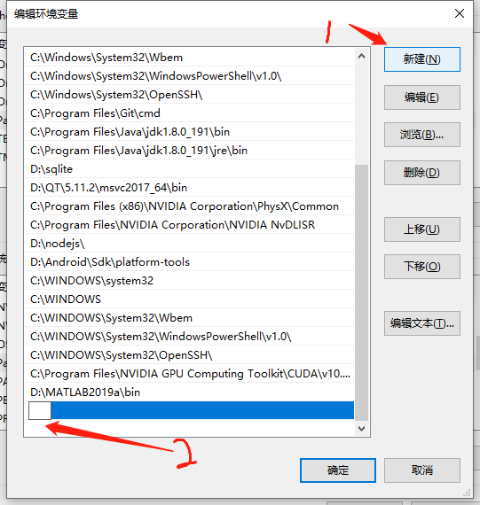

# mdout 安装指南

## 0. 特殊国情

由于大陆的特殊国情，访问 github 速度很慢甚至会失败，以下的 https 链接都来自 github ，如果访问失败可以尝试使用我提供的代理下载。

代理的使用方式为，在原有的完整链接之前加上 `https://ghproxy.cfjabin.workers.dev/` 。

例如 github 原链接为 `https://github.com/JabinGP/mdout/releases/download/0.6.0/mdout.macOS.x86-64.tar.gz` ，加上代理前缀后则是 `https://ghproxy.cfjabin.workers.dev/https://github.com/JabinGP/mdout/releases/download/0.6.0/mdout.macOS.x86-64.tar.gz` 。

该代理支持下载仓库源码文件，也支持克隆仓库、下载release文件。

但需要注意的是，该代理会将一些请求分散到其他免费的cdn服务上，例如 `jsDelivr` ，无法保证通过该代理获取的文件与 github 原链接的文件是同步更改的，因为cdn存在更新延迟。

该代理无法保证可用性（即能成功访问并下载），也无法保证一致性（即通过代理下载的文件与原链接文件一致），但大多数情况下使用该代理是没问题的，只是最好以 github 原链接为准。

## 1. 安装方式说明

mdout 的安装分为三步：

1. 获取 mdout 可执行文件
2. 配置 mdout 命令
3. 下载 mdout 主题

如果你的系统是 macOS 或者 linux ，这三个部分可以被简化成一个脚本：

```cmd
bash -c "$(wget https://raw.githubusercontent.com/FisherWY/Shell/master/mdout/install_mdout.sh -O -)"
```

### 2. 获取 mdout 可执行文件与命令配置

mdout 可执行文件有两种方式获取：

1. 源码编译
2. 直接从release界面获取可执行文件

#### 2.1. 源码编译获取可执行文件

> 从源码编译要求 golang 1.13 以上版本。

```bash
# 克隆源码
git clone https://github.com/JabinGP/mdout.git
# 进入项目
cd mdout
# 编译
go build .
# 执行成功在项目目录中生成了可执行文件 mdout
```

#### 2.2. 从release下载对应平台可执行文件

mdout 基于 golang ，得益于 golang 交叉编译的特点，可以提前为各平台（windows、linux、macOS）打包可执行文件release出来供大家下载，这样就不需要要求使用者具备 golang 开发环境了。

进入 [release界面](https://github.com/JabinGP/mdout/releases) 找到最新的 `release` ，打开 `Assets` 既可以看到类似如下的文件列表：

- mdout.linux.x86-64.tar.gz 7.82 MB
- mdout.macOS.x86-64.tar.gz 7.72 MB
- mdout_windows_x86-64.tar.gz 7.65 MB
- Source code (zip)
- Source code (tar.gz)

下载 mdoutxxxxx 解压后即可获得对应平台的可执行文件。

##### 2.2.1 windows获取可执行文件并配置命令的步骤

1. 选择 `mdout_windows_x86-64.tar.gz` 左键点击下载，下载完成后解压即可获得 `mdout.exe`

2. 确定  `mdout.exe` 所在文件夹，例如我的电脑中的 `D:\mdout`
      

3. 设置环境变量，右键我的电脑 -> 选择属性 -> 左边的高级系统设置
      

4. 选择高级 -> 点击环境变量
      

5. 找到下半部分的系统变量，双击`Path`行
      

6. 在弹出来的窗口选择新建
      

7. 填入`D:\mdout`，然后一定要连续点完三个确定
      

8. 检验是否成功打开cmd，或者powershell，或者你有gitbash都ok（推荐使用命令行的windows用户都装一个gitbash），输入`mdout`，看到如下输出就是成功了
    

##### 2.2.2 linux获取可执行文件并配置命令的步骤

1. 选择 `mdout.linux.x86-64.tar.gz` 右键复制链接

2. 通过命令行下载、解压

    ```bash
    wget {$DownloadLink}
    tar -xvzf mdout.linux.x86-64.tar.gz
    ```

3. 放入系统可执行文件目录

    ```bash
    sudo mv mdout /usr/local/bin
    ```

4. 检验是否成功

    ```bash
    # 看到版本号输出就成功
    mdout --version
    ```

##### 2.2.3 macOS获取可执行文件并配置命令的步骤

1. 选择 `mdout.macOS.x86-64.tar.gz` 右键复制链接

2. 通过命令行下载、解压

    ```bash
    wget {$DownloadLink}
    tar -xvzf mdout.macOS.x86-64.tar.gz
    ```

3. 放入系统可执行文件目录

    ```bash
    mv mdout /usr/local/bin
    ```

4. 检验是否成功

    ```bash
    # 看到版本号输出就成功
    mdout --version
    ```

### 3. 初始化主题包

mdout 的主题有两种方式初始化：

1. 通过 mdout 内置命令解压 github 归档的 zip 文件形成主题包
2. 通过其他方式手动获取主题包

#### 3.1. 配置文件夹说明

mdout 在运行时会自动在用户的家目录下创建一个名为 mdout 的配置文件夹，并且在一般而言结构应该如下所示：

```text
mdout
|-- conf.toml
|-- log
|   `-- xxxx-x.log
`-- theme
    |-- github
        |-- css
        |-- index.html
        `-- lib
```

不同平台的家目录不同，最终导致不同平台的 mdout 配置文件夹路径不同，以下表格以用户为 `jabin` 举例：

|平台|配置文件夹路径|
|-|-|
|windows|C:/Users/jabin/mdout|
|linux|/home/jabin/mdout|
|macOS|/Users/jabin/mdout|

#### 3.2. 通过 mdout 内置命令获取主题包

下载主题包需要指定两个参数：

1. 第一个参数为 `-u` 接上主题包下载链接
2. 第二个参数 `-n` 指定该主题包下载后命名为什么，推荐名为 `github` ，因为不修改配置文件和指定主题参数的情况下，mdout 默认会使用名为 `github` 的主题包。

```cmd
mdout install theme -u {$ThemeDownloadLink} -n {${ThemeName}}
```

|主题|仓库地址|主题包下载链接|
|-|-|-|
|仿github主题0.1.0|[JabinGP/mdout-theme-github](https://github.com/JabinGP/mdout-theme-github)|[github链接](https://github.com/JabinGP/mdout-theme-github/archive/0.1.0.zip)|

#### 3.3. 手动获取主题包

手动获取有很多种方式，甚至可以自己创建一个主题包，这里就先介绍用 git 克隆配套的仿github主题。

参考 3.1 中的不同平台配置文件夹路径以及文件位置，进入 mdout/theme 文件夹，利用 git 将主题包克隆到该文件夹中：

```bash
# 例如将 JabinGP/mdout-theme-github 克隆并保存为主题名 github
git clone https://github.com/JabinGP/mdout-theme-github github
```
